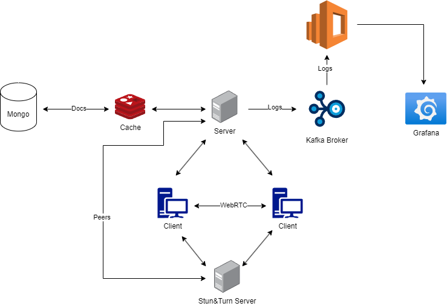

# SyncDraft

- A web application consisting in a collaborative text editor.

## Modules

### Clients

- multiple clients can modify one document at the same time
- given that the session initiatior has an account, the document will be saved in the database

### Server

- in order to establish a connection between two or more clients, we need a signaling server, which will run on the main server and with the help of the Stun & Turn server, it will provide a list of compatible peers
- the server will be responsible to save the documents and miscellaneous information for the user
- it will also provide statistics, logs and critical information for the analytical modules

### Analytics

- the server will produce events that will be acknowledged by the kafka broker, which will further be consumed and written to the elasticsearch database
- to get a better grasp of server's state, we will display the above mentioned infromation through grafana

### Persistence

- we will provide a caching mechanism to allow for a fast response 
- we will also provide a fallback through the database in case the server can't establish a peer to peer connection

## Document syncronizations

- WebRTC -> CmRDT(Communtative Replicated Data Types)
    - advantages
      - given a reliable client you have data privacy.
      - lower ping.
      - easier to scale.
    - disadvantages
      - STUN & TURN servers for peer discovery & relay(in case of TURN) caused by clients NATs.

## Architecture

## Technologies

- Rust - backend consumer, server
- Svelte - frontend
- Mongo - database
- Redis - cache
- Kafka - message broker
- Grafana - visualization
- Elasticsearch - database for statistics
- Coturn - stun & turn server
